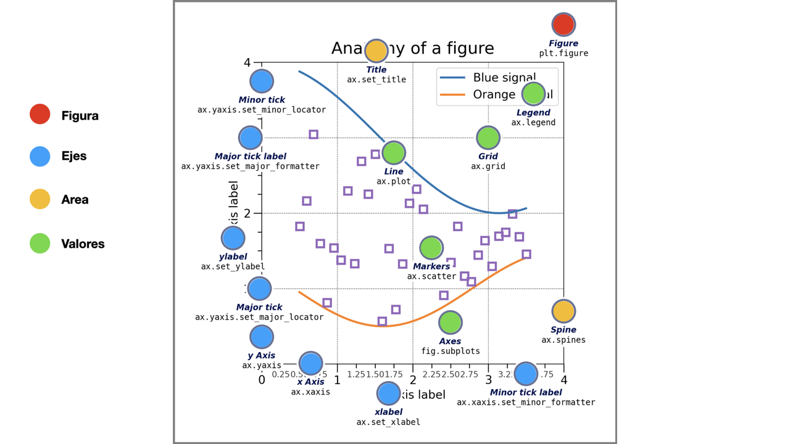

# 📊 Visualización de Datos
**Objetivo del módulo:** Aprender a comunicar hallazgos mediante gráficos eficaces.

**Resultados de Aprendizaje:**
- Generar visualizaciones claras y persuasivas.

**Contenidos:**
1. Principios de visualización
2. [Matplotlib](Matplotlib.ipynb)
3. [Seaborn](Seaborn.ipynb)
4. Dashboards básicos con Plotly Express
5. [Storytelling con datos](Storytelling.ipynb)

## Elementos generales de visualización

**Anatomía general de un gráfico**

La gran mayoría de gráficos comparten los mismos elementos:
- Un área de graficos
- Ejes, que contienen los valores, categorías y marcas, mayores y menores
- Valores, contenidos en líneas o barras u otros

