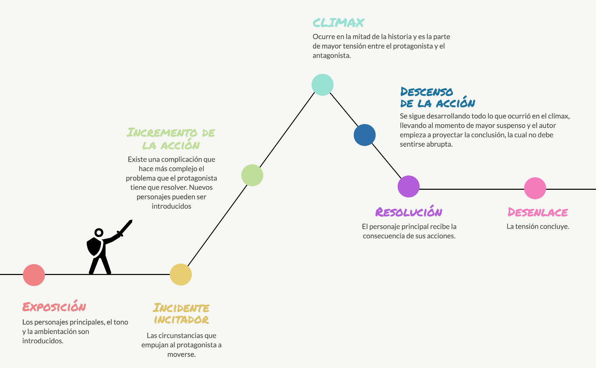

# Storytelling en Ciencia de Datos

## Definiendo el Data Storytelling: La Síntesis de Datos, Visualización y Narrativa

El storytelling con datos, o data storytelling, representa una evolución fundamental en la comunicación de información dentro del ámbito de la ciencia de datos. No se trata simplemente de presentar cifras o crear gráficos atractivos; es una disciplina que combina tres pilares interconectados para transformar datos complejos en mensajes comprensibles, memorables y accionables. Los tres elementos clave son los datos, la visualización y la narrativa. Los datos proporcionan la base empírica y la evidencia factual sobre la que se asienta toda la historia. La visualización actúa como el vehículo que ilumina y organiza esta información, haciéndola tangible y fácilmente digestible. Finalmente, la narrativa es el hilo conductor que da contexto, estructura y significado a los datos y las visualizaciones, conectando emocionalmente con la audiencia y guiándola hacia una conclusión o acción deseada.

En su esencia, el objetivo principal del data storytelling es ir más allá de la simple transmisión de hechos para lograr un impacto duradero. Se busca que la audiencia no solo entienda la información presentada, sino que también la recuerde y, crucialmente, actúe en consecuencia. Este enfoque reconoce que las personas procesan y retienen mejor la información cuando está integrada en una historia coherente. Como afirma Jennifer Aaker, profesora de marketing en la Universidad de Stanford, las historias son inherentemente más memorables que los hechos aislados. De manera similar, Jerome Bruner sostiene que el relato es una poderosa estructura cognitiva para dar sentido a la experiencia humana. Por lo tanto, el data storytelling no es meramente una técnica de presentación, sino una estrategia de comunicación diseñada para influir y persuadir.

La diferencia entre un análisis exploratorio de datos (EDA) y uno explicativo es fundamental para comprender el propósito del storytelling. El EDA es un proceso de descubrimiento inicial donde el analista investiga los datos sin una idea preconcebida, buscando patrones, anomalías y relaciones. Es un viaje de descubrimiento personal para quien realiza el análisis. En contraste, el data storytelling es un ejercicio de comunicación dirigida. Aquí, el analista ya ha identificado una historia específica que desea contar y una audiencia que debe recibir un mensaje claro y específico. El objetivo no es explorar, sino comunicar una narrativa coherente que respalde una decisión o cambie una percepción. Esta distinción es vital para los estudiantes, ya que marca la transición desde el rol de científico de datos (quien explora) al de comunicador de datos (quien narra).

El valor estratégico del data storytelling se manifiesta en múltiples beneficios. Mejora la comprensión y hace que los datos sean memorables, lo cual es crucial para asegurar que los hallazgos perduren en la mente de la audiencia. Ayuda a convencer y a tomar decisiones informadas, ya que presenta el análisis de forma coherente y persuasiva. Además, construye confianza y generación de compromiso (engagement), simplifica la información compleja y refuerza la autoridad del analista. Según estudios, la mayoría de las empresas utilizan datos para optimizar la asignación de recursos, reduciendo costos y mejorando la eficacia, un proceso que se potencia enormemente con un buen storytelling. Herramientas que democratizan el acceso a los datos dependen de la capacidad de los usuarios para comunicar sus hallazgos de manera efectiva a través de narrativas claras. En última instancia, el data storytelling es la herramienta que permite que los resultados de años de investigación y modelado lleguen a ser prácticas operativas, estrategias empresariales y cambios tangibles.

## La Estructura Narrativa: Construyendo Historias que Informan y Persuaden

La estructura narrativa es el esqueleto que soporta cualquier historia exitosa, y en el data storytelling, proporciona la coherencia necesaria para guiar a una audiencia a través de datos complejos hasta una conclusión clara. Una de las estructuras más citadas y aplicables es la tricotomía de situación-inicio-problema-resolución, que divide la narrativa en tres fases fundamentales. La primera fase, la situación inicial, establece el escenario, introduce a los personajes (que pueden ser KPIs, departamentos o mercados) y describe el estado de cosas antes de que ocurriera algo significativo. La segunda fase, el surgimiento de problemas o complicaciones, es donde se presenta el conflicto central: una tendencia negativa, un valor atípico, una brecha insostenible o una oportunidad inesperada que requiere atención. Finalmente, la tercera fase ofrece una resolución, proponiendo soluciones, acciones recomendadas o una nueva perspectiva basada en los hallazgos de los datos. Esta estructura sencilla pero poderosa da sentido a los datos y facilita la comprensión, permitiendo a la audiencia seguir el argumento sin sentirse abrumada.

Otras estructuras narrativas, adaptadas al lenguaje corporativo, ofrecen marcos similares. La estructura de inicio-desarrollo-desenlace es una variante directa que enfatiza la progresión de una premisa inicial a una conclusión. Una adaptación más formal es la estructura de la pirámide de Freytag, común en la literatura dramática, que se traduce perfectamente al mundo de los negocios como Introducción/Contexto -> Conflicto -> Resolución. Esta estructura puede desglosarse en cuatro fases aún más detalladas: describir personajes y objetivos, establecer el contexto, introducir el conflicto o problema y proponer soluciones. El estándar IBCS (International Business Communication Standards) sigue una lógica muy parecida, proponiendo una exposición (situación actual), un conflicto (el problema o desafío) y una resolución (la solución o mensaje principal). Para los estudiantes, estas estructuras no son reglas rígidas, sino guías flexibles que deben adaptarse al tema y a la audiencia específicos.

### La Pirámide de Freytag
La Pirámide de Freytag es un modelo de estructura narrativa desarrollado por el dramaturgo alemán Gustav Freytag, que divide un drama en cinco secciones: exposición, acción ascendente, clímax, acción descendente y desenlace (o catástrofe). Este marco, inspirado en la estructura de Aristóteles y Horacio, ayuda a analizar y planificar cómo la tensión y el conflicto se desarrollan en una historia, presentando un patrón clásico para la narrativa, especialmente en las tragedias. 

Los cinco elementos de la Pirámide de Freytag:
1. Exposición: Se presenta el escenario, los personajes y el contexto inicial de la historia. 
2. Acción ascendente: La tensión aumenta a medida que el conflicto principal se desarrolla y los personajes enfrentan desafíos. 
3. Clímax: Es el punto de máxima tensión e inflexión en la historia, donde el conflicto alcanza su punto álgido. 
4. Acción descendente: Tras el clímax, las consecuencias se despliegan, y la tensión disminuye. 
5. Desenlace (o Catástrofe): La historia llega a su conclusión, resolviendo el conflicto principal y, en el caso de las tragedias, resultando en la caída del protagonista. 

Independientemente de la estructura elegida, la clave reside en mantener una lógica horizontal y vertical en la presentación. La lógica horizontal se refiere a la coherencia general del discurso, asegurando que el mensaje principal se mantenga constante a lo largo de todas las diapositivas o secciones de la narrativa. La lógica vertical, por otro lado, se centra en cada elemento individual (como una diapositiva o un gráfico). Cada visualización debe ser autocontenida, ofreciendo suficiente contexto y texto para que el espectador comprenda su importancia incluso si salta directamente a ella, mientras se refuerza y complementa el mensaje general de la historia. Para verificar la fluidez de este flujo narrativo, se recomienda utilizar una técnica como el storyboard inverso, donde se construye la historia desde el final hacia atrás para asegurar que cada punto conducido sea lógicamente necesario para llegar a la conclusión.

La elección de la estructura narrativa tiene implicaciones directas en la recepción de la audiencia. Las historias humanizan los datos, creando una conexión emocional que va más allá de la pura lógica racional. Se ha demostrado que las narrativas aumentan la motivación estudiantil en un 30% y la participación en clase en un 30%, y que pueden mejorar la retención de información hasta en un 20%. Al presentar los datos a través de una historia, el analista no solo informa, sino que involucra a la audiencia, haciendo que se interesen por el resultado y se comprometan con el mensaje. Esto es especialmente relevante en contextos educativos, donde el storytelling se utiliza para hacer temas complejos como el duelo o la ética más accesibles y promover el pensamiento crítico. Por ello, un buen data storyteller no solo es un experto en datos, sino también un maestro en la construcción de una experiencia de audiencia coherente y envolvente.

| Estructura Narrativa | Fases Clave | Aplicación en Data Storytelling |
| :--- | :--- | :--- | :--- |
| **Tricotomía** | Situación-Inicio-Problema-Resolución | Divide la historia en escenario, cambio, impacto y solución. Ideal para informes claros. |
| **Estructura Literaria** | Inicio-Desarrollo-Final | Simplifica la lógica narrativa para una comunicación directa y concisa. |
| **Pirámide de Freytag** | Introducción/Contexto - Conflicto - Resolución | Estructura dramática adaptada a problemas de negocio y soluciones. |
| **IBCS Standard** | Exposición (Situación) - Conflicto (Problema) - Resolución (Mensaje) | Marco formal para la comunicación de datos corporativos. |
| **Storytelling Educativo** | Personaje, Entorno, Conflicto, Mensaje | Enfocado en la empatía y la conexión emocional para facilitar el aprendizaje. |

## Conociendo a tu Audiencia: El Pilar Fundamental de una Comunicación Efectiva

Conocer profundamente a la audiencia es el principio rector y el pilar más importante en el data storytelling. Sin una comprensión clara de quién recibe la información, por qué deberían interesarse y qué harán con ella, cualquier esfuerzo en la recolección de datos, la visualización o la narración será en vano. [Donald Farmer](https://www.linkedin.com/in/donalddotfarmer/), un estratega de datos con vasta experiencia, destaca que una de las primeras preguntas que debe responder el analista es: "¿Qué pregunta(s) tiene mi audiencia?". Anticipar estas preguntas permite al analista seleccionar los datos correctos, diseñar las visualizaciones más pertinentes y construir una narrativa que resuelva directamente las dudas o necesidades de la audiencia, evitando así interrupciones y distracciones durante la presentación.

La personalización de la narrativa es crucial. Diferentes roles dentro de una organización tienen diferentes preocupaciones y necesitan información diferente. Un director de ventas probablemente estará más interesado en métricas de conversión y retorno de la inversión (ROI) de una campaña, mientras que un director de recursos humanos buscará datos sobre la tasa de rotación de empleados o la efectividad de los programas de capacitación. Por lo tanto, el analista debe segmentar su audiencia y adaptar el mensaje en consecuencia. Esto implica no solo elegir los indicadores de rendimiento clave (KPIs) adecuados, sino también ajustar el nivel de detalle técnico y el tono de la narrativa. Para una audiencia ejecutiva, el foco debe estar en los resultados, el impacto estratégico y las acciones recomendadas. Para un equipo técnico, podría ser necesario incluir más detalles sobre los modelos utilizados o las limitaciones de los datos.

### Conociendo a tu Audiencia, pregúntate:

¿Qué nivel de conocimiento técnico tiene mi audiencia?
¿Qué decisiones debe tomar con esta información?
¿Qué les importa? ¿Costos? ¿Experiencia del cliente? ¿Crecimiento?

tabla
Conociendo a tu Audiencia: El Pilar Fundamental
El éxito del data storytelling depende de a quién te diriges. Pregúntate:

¿Qué nivel de conocimiento técnico tiene mi audiencia?
¿Qué decisiones debe tomar con esta información?
¿Qué les importa? ¿Costos? ¿Experiencia del cliente? ¿Crecimiento?

| Rol                  | Enfoque Narrativo           | Tipos de Métricas/Visualización         | Nivel de Detalle           |
|----------------------|-----------------------------|-----------------------------------------|----------------------------|
| CEO / Alta Dirección | Impacto estratégico, ROI    | KPIs, métricas resumen                  | Alto nivel, sin tecnicismos|
| Gerente de Producto  | Comportamiento del usuario  | Flujos, mapas de calor                  | Detalle operativo          |
| Equipo de Ingeniería | Calidad de datos, modelo    | Métricas de rendimiento, distribuciones | Técnico, con código o estadísticas |
| Marketing            | Segmentación, campañas      | Conversiones, engagement                | Narrativo, orientado a resultados  |

**Ejemplo real:**

En un proyecto universitario sobre consumo energético, un equipo presentó dos versiones:

- Para el rectorado: un dashboard con ahorro potencial en € y CO₂.
- Para el equipo de mantenimiento: un informe con sensores defectuosos y horarios pico.

Ambos usaban los mismos datos, pero con narrativas distintas.

**Ejemplo real:**

En un proyecto universitario sobre consumo energético, un equipo presentó dos versiones:

- Para el rectorado: un dashboard con ahorro potencial en € y CO₂.
- Para el equipo de mantenimiento: un informe con sensores defectuosos y horarios pico.

Ambos usaban los mismos datos, pero con narrativas distintas.

Además de la función, el conocimiento previo de la audiencia es vital. Si la audiencia ya posee un alto grado de alfabetización en datos, puede manejar visualizaciones más complejas y un mayor nivel de detalle técnico. Sin embargo, si la audiencia es mixta o predominantemente no técnica, es imperativo simplificar la jerga, usar analogías claras y centrarse en los conceptos principales. La meta es siempre hacer que la información sea accesible y memorable para todos los involucrados. Por ejemplo, en un proyecto escolar sobre el comportamiento de compra en Walmart antes de huracanes, el narrador debía usar un lenguaje accesible para conectar con la audiencia desde el principio, destacando el hallazgo sorprendente de que los Pop-Tarts eran el producto más vendido.

El conocimiento de la audiencia también influye en el tipo de producto de visualización que se crea. Un cuadro de mando interactivos destinado a un usuario que realizará un análisis profundo requerirá diferentes características narrativas que un informe estático presentado a un comité de dirección. Los dashboards interactivos pueden beneficiarse de una narrativa más libre, permitiendo a la audiencia explorar los datos por sí misma, mientras que los informes estáticos exigen una secuencia de visualizaciones y texto cuidadosamente planificada para guiar al lector paso a paso. Herramientas como Tableau 'Historias' o Power BI permiten integrar múltiples visualizaciones y paneles en una secuencia narrativa coherente, ideal para presentaciones dirigidas. En última instancia, el éxito del data storytelling depende de la capacidad del analista para ponerse en el lugar de su audiencia, pensar como ellos y comunicar de una manera que resuene con sus prioridades, intereses y nivel de conocimiento.

## Visualizando la Historia: Principios de Diseño para la Comunicación Clara

La visualización de datos es el puente entre los números crudos y la comprensión humana. Es a través de las visualizaciones que los datos cobran vida, revelando patrones, tendencias y anomalías que de otro modo pasarían desapercibido. Sin embargo, una visualización bien diseñada no es solo estéticamente agradable; es una herramienta de comunicación precisa y deliberada. Sus principios están orientados a guiar la atención del espectador, resaltar la información más importante y minimizar la carga cognitiva. El objetivo es que la audiencia pueda entender rápidamente el punto principal de una visualización sin tener que leer extensos textos de apoyo.
Uno de los principios fundamentales es la selección adecuada del tipo de gráfico para el tipo de dato. Esta elección determina cómo la audiencia interpretará la información. Por ejemplo, los gráficos de barras son ideales para comparaciones entre categorías discretas, como los gastos de diferentes departamentos. Los gráficos de líneas son excelentes para mostrar la evolución de una variable a lo largo del tiempo, como las series temporales o las tendencias. Los diagramas de dispersión pueden ser útiles para mostrar la relación entre dos variables, aunque, según algunos expertos, pueden dificultar la comparación de áreas, lo que sugiere preferir gráficos de barras para comparaciones claras. Herramientas como Tableau, Power BI y Plotly permiten crear estos gráficos de manera eficiente, y plataformas como Plotteus están enfocadas específicamente en la visualización narrativa.

La simplicidad y la limpieza visual son otros pilares del diseño efectivo. El principio de "menos es más" es crucial para evitar la sobrecarga de información. Esto implica eliminar todo lo que no contribuye directamente al mensaje principal, un proceso conocido como "decluttering". Elementos como bordes innecesarios, sombras, múltiples colores o tipografías diferentes pueden distraer y confundir al espectador. La jerarquía visual debe ser clara, utilizando tamaño, grosor y color de manera intencionada para guiar la mirada hacia los puntos más importantes. Se recomienda reservar el uso del color para fines semánticos, como usar verde para indicar un resultado positivo y rojo para uno negativo, y limitar el uso del color a un máximo de uno o dos para enfatizar dimensiones valiosas.

El contexto es otra dimensión crítica que a menudo se pasa por alto. Un número por sí mismo es casi siempre incomprensible. Es necesario dar significado a los datos mediante el uso de comparaciones relevantes, como referencias a metas anteriores, la media del sector o el impacto en el negocio. Por ejemplo, decir "vendimos 1.500 unidades" es menos impactante que decir "vendimos 1.500 unidades, superando nuestra meta mensual en un 23%". Además, el diseño debe ser consistente en cuanto a colores, fuentes y formatos para transmitir profesionalismo y facilitar la lectura. Pruebas con usuarios reales son esenciales para validar que el dashboard o informe es intuitivo y cumple su propósito sin causar confusiones. Siguiendo estos principios, el analista puede transformar una colección de datos en una serie de imágenes claras y convincentes que apoyen y amplifiquen la narrativa central.

| Principio de Diseño Visual | Descripción | Ejemplo Práctico |
| :--- | :--- | :--- |
| **Selección de Gráfico** | Usar el tipo de gráfico más adecuado para el tipo de dato y la relación que se quiere mostrar. | Usar un gráfico de líneas para mostrar la tendencia de ventas mensuales a lo largo de un año. |
| **Jerarquía Visual** | Organizar visualmente los elementos para guiar la atención hacia la información más importante. | Usar un tamaño de fuente más grande para el título principal y un color distintivo para el dato clave. |
| **Minimalismo** | Eliminar elementos visuales no esenciales para reducir la distracción y la carga cognitiva. | Retirar sombras, bordes y fondos de gráficos, dejando solo los ejes y las series de datos. |
| **Color Estratégico** | Usar el color de manera consistente y semántica para codificar información y resaltar puntos clave. | Reservar el color verde para indicar valores sobre la media y el rojo para valores por debajo de la media. |
| **Agregación de Contexto** | Proporcionar datos de referencia para que los números tengan un significado medible. | Mostrar una línea punteada en un gráfico de barras representando la meta anual junto con las ventas mensuales. |
| **Consistencia** | Mantener un estilo uniforme en colores, fuentes y formato a lo largo de toda la presentación o informe. | Usar el mismo esquema de colores y estilo de fuente en todos los gráficos de un informe financiero. |

## Del Proyecto a la Presentación: Escenarios de Aplicación y Líneas de Tiempo

El proceso de llevar un proyecto de ciencia de datos desde su concepción hasta su presentación formal es un viaje que requiere planificación, disciplina y una estructura narrativa clara. Una herramienta fundamental para gestionar y comunicar este proceso es la línea de tiempo. Una línea de tiempo de proyecto es una representación visual de las tareas cronológicas, mostrando fechas de inicio y fin, hitos clave y las dependencias entre las actividades. Su propósito principal es la planificación, ayudando a los equipos a organizar el trabajo, asignar responsabilidades y establecer plazos realistas. Herramientas como ProjectManager, GanttPRO, Flowlu o Miro permiten crear líneas de tiempo interactivas, a menudo basadas en diagramas de Gantt, que facilitan el seguimiento del progreso en tiempo real y la colaboración entre los miembros del equipo.

Para un estudiante de ciencia de datos, una línea de tiempo es una herramienta invaluable para documentar y presentar su propio proceso de aprendizaje o un proyecto de curso. Puede servir como una infografía cronológica que resume los pasos seguidos, desde la definición del problema hasta la implementación de las recomendaciones. Por ejemplo, una línea de tiempo de proyecto podría estructurarse en fases como: 
1) Descubrimiento (entender las necesidades del negocio y definir el problema), 
2) Modelado (desarrollar wireframes y la lógica de los análisis), 
3) Construcción (ejecutar el código, limpiar los datos y entrenar los modelos), 
4) Validación (probar el producto con usuarios reales) y 
5) Publicación (presentar los resultados y mantener el producto). 

Cada una de estas fases podría contener hitos específicos, como "Finalización del análisis exploratorio", "Entrega del informe intermedio" o "Presentación final".

Los formatos de las líneas de tiempo pueden variar, pero suelen ser horizontales o verticales. Las líneas de tiempo horizontales (diagramas de Gantt) son excelentes para mostrar la duración de las tareas y sus dependencias en un formato de calendario. Las verticales son útiles para mostrar ciclos de vida o eventos históricos. Plantillas gratuitas están disponibles en herramientas como Venngage, Canva o PowerPoint, lo que permite a los estudiantes crear presentaciones visuales sin necesidad de experiencia previa en diseño. Elementos clave para una línea de tiempo efectiva incluyen títulos, subtítulos, fechas clave, iconos temáticos y una codificación por colores para diferenciar tipos de tarea o fases del proyecto. Este tipo de visualización no solo es útil para la gestión del proyecto, sino que también puede formar parte de la propia presentación del proyecto, demostrando al público la metodología rigurosa y estructurada que se siguió.

Además de la línea de tiempo de proyecto, existen otros escenarios de aplicación que demuestran el poder del storytelling en la ciencia de datos. Netflix, por ejemplo, utilizó datos sobre los gustos del público por las películas de ciencia fición de los años 80 y las series de terror para lanzar la exitosa serie "Stranger Things". Coca-Cola transformó su campaña "Share a Coke" al reemplazar su icónico logotipo por nombres populares, un movimiento impulsado por datos que resultó en un aumento de ventas del 2.5%. Airbnb utiliza precios dinámicos basados en oferta, demanda y eventos locales, un sistema alimentado por datos que optimiza los ingresos y la satisfacción del cliente. Estos ejemplos corporativos demuestran que el storytelling con datos no es solo una habilidad académica, sino una ventaja competitiva estratégica que permite tomar decisiones audaces y creativas.

## Herramientas y Recursos para el Estudiante: Desde Jupyter Notebooks a Cuadros de Mando Interactivos

Para un estudiante de ciencia de datos, la adquisición de habilidades en storytelling implica familiarizarse con una suite de herramientas que abarcan desde el análisis de datos hasta la creación de presentaciones narrativas. El ecosistema digital ofrece una amplia gama de opciones gratuitas y comerciales que pueden ser utilizadas para aprender y practicar. El núcleo del proceso de aprendizaje a menudo reside en los cuadernos de Jupyter (Notebooks), que permiten integrar código, visualizaciones y texto en un único documento interactivo. Repositorios como GitHub y Kaggle son verdaderas minas de oro de proyectos de práctica que sirven como ejemplos de storytelling aplicado.

Un estudiante puede encontrar proyectos de ejemplo en repositorios públicos de GitHub relacionados con data storytelling. Estos pueden incluir cuadernos de Jupyter que realizan un análisis exploratorio exhaustivo (EDA) sobre diversos conjuntos de datos, como el reconocimiento de dígitos MNIST, la predicción de precios de viviendas o la clasificación de pulsares. Otros repositorios pueden contener proyectos completos desarrollados en tecnologías como Vue.js para interfaces de usuario de datos (vue-data-ui) o JavaScript para narrativas interactivas (plotteus). Explorar estos cuadernos es una excelente manera de ver cómo otros analistas estructuran sus hallazgos, elijo sus visualizaciones y construyen una narrativa a partir de cero.

Las plataformas de competencias como Kaggle también son un recurso invaluable. Allí, los estudiantes pueden participar en desafíos de ciencia de datos y, más importante aún, revisar los cuadernos de los ganadores o los más votados. Proyectos como un "Clean EDA Guide" con Seaborn, un análisis de las reservas de viaje de Uber en Nueva Delhi o un proyecto sobre salud mental estudiantil con más de 16,000 respuestas, ofrecen una visión de primera mano de cómo se aplica el storytelling en situaciones del mundo real. Estos cuadernos no solo muestran el código, sino que a menudo incluyen secciones detalladas que explican la lógica detrás de cada paso, las decisiones de visualización y los insights finales, actuando como tutoriales narrativos interactivos.

### Herramientas esenciales

| Categoría                  | Herramientas Principales                                 |
|----------------------------|---------------------------------------------------------|
| Análisis y Prototipado     | Jupyter Notebook, Google Colab, R Markdown              |
| Visualización Interactiva  | Tableau Public, Power BI, Plotly, Observable            |
| Diagramas y Storyboards    | Miro, Lucidchart, draw.io, Excalidraw                   |
| Líneas de Tiempo           | Timeline JS, Office Timeline, Mermaid                   |
| Presentaciones Narrativas  | PowerPoint, Canva, Google Slides                        |

Una vez que el análisis está completo, es hora de construir la narrativa final. Para esto, existen numerosas herramientas especializadas.
*   **Tableau:** Es líder en la industria para la creación de cuadros de mando interactivos. Su función "Historias" permite a los usuarios combinar múltiples vistas y dashboards en una secuencia narrativa coherente, ideal para presentaciones.
*   **Power BI:** Ofrece funcionalidades similares a Tableau, permitiendo la creación de dashboards navegables con páginas encadenadas que simulan una historia. Es una opción popular en el mundo corporativo.
*   **Plotly:** Una librería de Python/JavaScript que permite crear gráficos interactivos y animados, ideales para proyectos de storytelling web .
*   **Datawrapper / Coggle:** Herramientas más simples para crear visualizaciones estáticas y diagramas de flujo, respectivamente, que pueden complementar una narración.
*   **LibreOffice Draw / Lucidchart:** Excelentes opciones gratuitas para crear diagramas de flujo y líneas de tiempo, que son útiles para documentar flujos de trabajo y procesos de datos.

Para aquellos que buscan una educación más formal, existen cursos especializados. La Universidad de Chicago ofrece un curso en línea de 8 semanas sobre "Storytelling y Visualización de Datos Estratégicos", que cubre desde el análisis exploratorio hasta el desarrollo de árboles de recomendaciones, usando herramientas como Tableau y Alteryx. Otro curso, de Data Storytelling, enseña técnicas narrativas con una metodología BIDS (Business Intelligence and Data Storytelling), basándose en aprendizaje por proyectos con asesoría permanente y certificaciones internacionales. Estos recursos, combinados con la práctica constante y la exploración de proyectos reales, proporcionan a un estudiante el arsenal de herramientas y conocimientos necesarios para convertirse en un comunicador de datos efectivo.

## Referencias
Knaflic, C. N. (2015). Storytelling with Data: A Data Visualization Guide for Business Professionals. Wiley.
→ La obra fundamental sobre visualización narrativa en entornos profesionales.

Tufte, E. R. (2001). The Visual Display of Quantitative Information (2nd ed.). Graphics Press.
→ Clásico sobre principios de diseño en visualización de datos.

Davenport, T. H., & Harris, J. G. (2017). Competing on Analytics: The New Science of Winning. Harvard Business Review Press.
→ Incluye casos sobre cómo las empresas usan datos para decisiones estratégicas (ej. Netflix, Amazon).

Heer, J., Bostock, M., & Ogievetsky, V. (2010). "A Tour Through the Visualization Zoo". Communications of the ACM, 53(6), 59–67.
→ Revisión académica sobre tipos de visualizaciones y su uso adecuado.

Gallo, C. (2014). Talk Like TED: The 9 Public-Speaking Secrets of the World's Top Minds. St. Martin's Press.
→ Incluye el principio de que las historias son 22 veces más memorables que los hechos (basado en estudios de la Universidad de Stanford).

International Business Communication Standards (IBCS). (2023). IBCS® Standards. https://www.ibcs-association.org/
→ Marco formal para la comunicación de datos empresariales.
Tableau. (2023). Data Storytelling Best Practices. https://www.tableau.com/learn/articles/data-storytelling-best-practices
→ Guía práctica de una de las principales herramientas de visualización.
Kaggle. (2023). Notebooks on Data Storytelling. https://www.kaggle.com/code
→ Ejemplos reales de proyectos con narrativa integrada.

Storytelling with Data Blog. https://www.storytellingwithdata.com/blog
→ Recursos gratuitos, ejemplos y consejos de Cole Nussbaumer Knaflic.

Mayer, R. E. (2009). Multimedia Learning (2nd ed.). Cambridge University Press.
→ Fundamentos cognitivos sobre cómo las personas aprenden con combinaciones de texto, imágenes y narrativas.